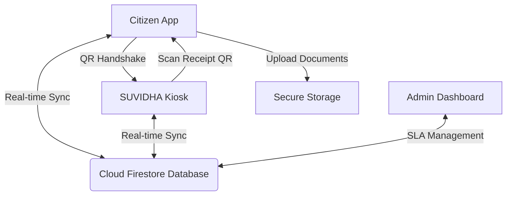
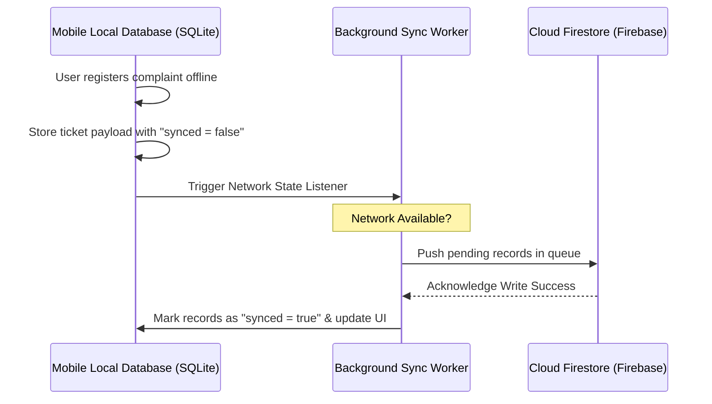

# Technical Specifications & Blueprint: SUVIDHA Standalone Citizen Mobile App
> **Project Theme:** Smart Urban Digital Helpdesk Assistant (SUVIDHA)  
> **Target Platforms:** Android & iOS (Cross-Platform Mobile Ecosystem)  
> **Objective:** Empower citizens with a unified, offline-resilient, secure, and accessible mobile gateway for Electricity, Gas, and Municipal services.

---

## 1. Executive Summary & Ecosystem Vision

While the **SUVIDHA Touch Kiosk** acts as the primary physical touchpoint in municipal offices to reduce counter congestion, the **SUVIDHA Citizen Mobile App** serves as the citizen's personal, remote companion. It bridges the gap between on-site kiosks and personal mobile devices. 

By utilizing a shared serverless backend (Firebase) and a secure unified database, transactions initiated on the kiosk (such as filing a grievance or requesting a connection) are instantly synced, tracked, and managed on the citizen’s mobile app.



---

## 2. Technical Stack Recommendation

To ensure quick deployment, maximum performance, and native feel, we propose the following modern mobile stack:

| Component | Technology | Rationale |
| :--- | :--- | :--- |
| **Framework** | **Flutter** or **React Native** (TS) | Cross-platform codebase with native performance and custom UI flexibility. |
| **Local DB** | **SQLite** or **Hive** | High-performance, local-first storage to support **Offline Operations**. |
| **Auth Gateway** | **Firebase Phone Auth** + **Aadhaar API** | Native SMS-based OTP delivery with secure session tokens. |
| **Security/Crypto** | **Libsodium** / **WebCrypto** wrapper | Hardware-backed keystore integration for storing sensitive citizen keys. |
| **Push Alerts** | **Firebase Cloud Messaging (FCM)** | Sub-second push alerts for SLA updates and municipal alerts. |

---

## 3. Screen-by-Screen UI/UX Flow & Navigation

The application uses a **Bottom Navigation Bar** layout to maximize ergonomic accessibility on modern high-aspect-ratio screens.

```
+------------------------------------+
|   [Status Bar: Time, 5G, Battery]   |
|   SUVIDHA Citizen Logo    [Alerts] |
+------------------------------------+
|  [Welcome Card: Rohan Sharma]      |
|  "Active Tasks: 2 | Approved: 1"   |
|                                    |
|  [Quick Actions]                   |
|  + New Grievance   + New Connection |
|                                    |
|  [Active Civic Outages]            |
|  ⚠️ Ward 5: Water Supply Offline    |
+------------------------------------+
|  [Home]  [Tickets]  [Locker]  [FAQ] |
+------------------------------------+
```

### Screen 1: Language & Department Selection Gateway
* **Visual Structure:** Clean, high-contrast buttons with local languages (English, Hindi, Assamese).
* **Workflow:** Select preferred language $\rightarrow$ Select Organization (Electricity / Gas / Municipal) $\rightarrow$ Input Account Identifier (CA / Consumer ID / Aadhaar).
* **Persistence:** Language selection is persisted globally.

### Screen 2: OTP Login & Session Key Exchange
* **Visual Structure:** Minimal numeric input fields, auto-focus, large click targets.
* **Workflow:** Citizen enters mobile number $\rightarrow$ Receives dynamic 6-digit OTP $\rightarrow$ Enters OTP $\rightarrow$ System registers device hardware key with server.

### Screen 3: Unified Dashboard (Home)
* **Features:**
  * **Dynamic Welcome Widget:** Displays greetings based on local time.
  * **Quick Navigation Cards:** Icon-driven links to file new connections, request shifts, or report damage.
  * **Civic Alerts ticker:** Displays live notifications from municipal bodies (e.g. water pipeline maintenance, power shutdowns).

### Screen 4: Active Ticket Timeline & Interactive Support
* **Features:**
  * **Progress Stepper:** Visual indicator showing steps: `Submitted` $\rightarrow$ `Under Review` $\rightarrow$ `Assigned` $\rightarrow$ `Resolved`.
  * **Embedded Chat:** Interactive support channel connecting citizens directly to assigned technicians or officers.

---

## 4. Feature Specifications by Department

### Part 1: Electricity Module
1. **Welcome Screen & Consumer Login:** OTP validation linked to a unique Consumer Account (CA) number.
2. **New Connection & Load Extension Requests:**
   * Step-by-step wizard capturing premises detail, required load (KW), and document uploads (Land deed, Aadhaar).
   * Generates a printable digital demand notice.
3. **Meter Replacement & Shifting Services:**
   * Dropdown selector for *Malfunction / Screen Damage / Physical Shifting*.
   * Prioritization flags calculated by Turnaround Time (TAT).
4. **Dispute Registration (Incorrect Bills):**
   * Input current meter reading $\rightarrow$ Compare historical consumption using interactive charts $\rightarrow$ Register dispute with photo evidence.
5. **Credential Management:** Update phone number or correct name spelling. Generates a secure cryptographic audit trail block for any update.
6. **Digital Receipt Wallet:** Automatically compiles receipt files for all transactions with a share button.

### Part 2: Gas Department Module
1. **Welcome Screen & User Login:** Authenticates using CA Number or legacy number.
2. **Main Menu & Service Navigation:** Quick links to connection change requests, bill lookup, or maintenance checks.
3. **New Connection / Connection Change Request:** Apply for postpaid-to-prepaid meter conversion, reconnection/disconnection, or scheduled pipeline safety inspection.
4. **Register Complaint:** Text or voice input (multilingual support) for gas leakage, delivery delay, or billing issue with image uploads.
5. **Track Complaint / Request:** Real-time lifecycle status with expected resolution SLA dates.
6. **Edit Credentials:** Secure updates of mobile number (with OTP) or address, logged in the cryptographic chain.
7. **Receipt Generation:** Instant delivery of digital receipts via SMS, Email, and WhatsApp.

### Part 3: Municipal Department Module
1. **Welcome Screen & User Login:** Citizen login via Consumer ID, Aadhaar, or Mobile OTP.
2. **Apply New Water Connection / Upgrade:** Digital workflow with address verification and ID upload.
3. **Register Municipal Grievances:** Centralized reporting for water supply, sewage, garbage irregularity, streetlights, or property tax errors.
4. **Track Request / Complaint:** Detailed history showing assigned officer and SLA timeline.
5. **Receipt Generation:** Proof of grievance submission, tax payment, or water connection application.
6. **Credential Management:** Securely view and edit profile with masked identifiers (Aadhaar).

---

## 5. Offline-First & Low Connectivity Architecture

Kiosks and mobile phones frequently operate in low-bandwidth environments. The app employs a **Local-First Synchronization Strategy**:



* **Data Compression:** Form data and images are dynamically resized and compressed client-side before queuing to minimize payload size.
* **Offline Token Generation:** Citizens receive an offline tracking code locally generated using hash components of their submission.

---

## 6. Security, Compliance & Data Privacy Shield

### Zero-Knowledge PII Protection
* All sensitive identifiers (Aadhaar, Bank Accounts) are encrypted client-side using **AES-256-GCM** before uploading to Firestore. The private decryption key remains on the user's mobile secure hardware element (Keychain/Keystore).
* Data in transit uses **TLS 1.3** exclusively.

### DPDP Act 2023 Compliance
* **Explicit Consent Screens:** Detailed consent check-boxes displayed before any form access.
* **Right to Erasure:** A simple "Delete Account" button in settings securely purges local database files and requests cloud records deletion.
* **Masked Identifiers:** Masking of private details on UI displays (`XXXX-XXXX-1234`).

### Hash Chain Audit Log
Every status update or credential modification generates a cryptographic hash transaction:
$$\text{Hash}_{\text{Current}} = \text{SHA256}(\text{Timestamp} + \text{Action} + \text{Payload} + \text{Hash}_{\text{Previous}})$$
This makes the audit trail fully immutable.

---

## 7. Unified Kiosk-to-Mobile Handshake (QR Bridge)

To connect the kiosk experience with the mobile experience:

1. **Session Transfer:** On completing a transaction at the Kiosk, the screen displays a dynamic QR code.
2. **Scan Handshake:** When scanned using the mobile app camera, it securely transfers the tracking session ID to the phone.
3. **No-Login Tracking:** Allows citizens to track that specific ticket on their phone without going through a full signup process.
