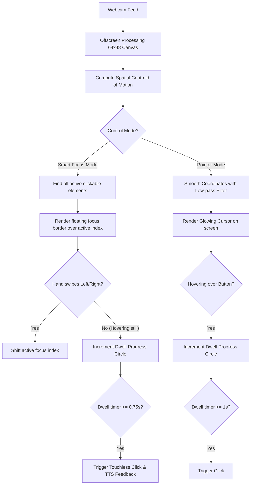

# Suvidha AirGestures™ Pro: Next-Gen Touchless Navigation System

Suvidha Smart Civic Kiosk now features a high-performance **Touchless Virtual Cursor**, **Kiosk Smart Focus System**, and **Motion Scroll Controller** using advanced real-time frame difference optical tracking.

Citizens can completely operate the kiosk, scroll through pages, slide elements, and click buttons without ever touching the screen.

---

## 🎮 Interactive Control Modes

Citizens can toggle between three high-tech touchless modes via the bottom-right accessibility menu:

### 1. Smart Focus Mode (Kiosk Default)
* **Interactive Focus Frame:** Sweeping hand left or right shifts active focus between interactive components (buttons, inputs, cards) with a glowing, animated orange border.
* **Hover-to-Select Badge:** When focus lands on an element, keeping the hand still for **0.75 seconds** fills a radial indicator badge and triggers a touchless click. This prevents hand strain and coordinate drift on large 55-inch screens.

### 2. Pointer Mode (Virtual Hand Cursor)
* **Smooth Hand Tracking:** The kiosk camera tracks the centroid of the user's hand and maps it to a large, glowing orange circle cursor on the screen.
* **Touchless Dwell Clicking:** The citizen hovers the virtual hand cursor over any button. A radial progress wheel fills up. After **1 second of steady hover**, an automatic touchless click is triggered.
* **Edge Scrolling:** Hovering the hand pointer at the very top (top 15%) or bottom (bottom 15%) of the viewport triggers smooth scrolling, allowing easy reading of long pages.

### 3. Swipes Mode (Spatial Gesture Navigation)
* **Horizontal Waves:** Wave hand from right-to-left to trigger **Next** / submit, and left-to-right to go **Back**.
* **Vertical Waves:** Wave hand downwards to scroll down a page, and upwards to scroll up.

---

## ⚙️ Tracking & Dwell Logic

### Technical Features:
* **Optical Centroid Calculations:** Resolves hand movement at 60 frames per second using frame differences.
* **Exponential Interpolation:** Prevents jittery mouse movement by smoothing coordinates with a low-pass filter (coefficient $0.15$).
* **Intelligent Dwell Filters:** Resolves the exact button or element at coordinates using standard DOM query (`document.elementFromPoint()`).
